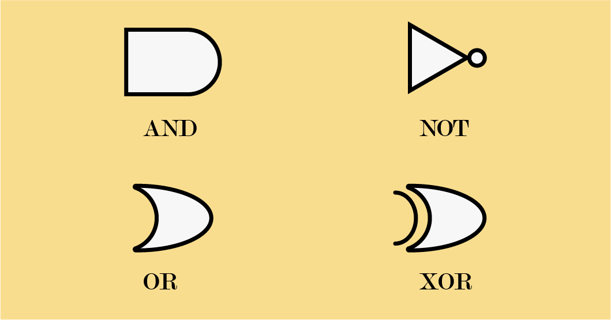

# Review of CMPUT 229

[](https://opensource.org/licenses/MIT)

This is a review document for CMPUT 229 at the University of Alberta for both [Nelson Amaral](https://webdocs.cs.ualberta.ca/~amaral/) and [Ali Karim](https://karimali.ca/). This review doc was written when school was remote so your experience may vary. 😔


## Index

* [Binary](#bin)
* [Architecture](#archm)
* [Circuits](#circuitsm)
* [MIPS Assembly (Ali Karim)](#ali)
  * [Overview](#overviewm)
  * [Assembly](#asmm)
  * [Marking](#marksm)
  * [Resources](#resourcem)
* [RISC-V Assembly(Nelson Amaral)](#nelson)
  * [Overview](#overviewr)
  * [Resources](#resourcer)


<a name=bin></a>

## Binary
Starting at the beginning with binary representation and 2's complement notation and moving on to hexadecimal notation. 2's complement can be understood by watching [the following video](https://youtu.be/mRvcGijXI9w). Hexadecimal can be thought of grouping the 4 digits of a binary number and combined/mapped to 1 character.

### Floating point numbers
Floating point numbers are a way to represent decimal numbers. A major limitation of the accuracy which will also depend on the magnitude of the number itself. A floating point number is divided into 3 sections and is inspired by the scientific notation but adapted for binary. The first section is 1-bit and represents the sign of the nubmer (positive or negative). The second section (length varies on implementation) is the exponent. The third section (length varies on implementation) is the significand.

When talking about floating point numbers, we usually use the [IEEE 754](https://en.wikipedia.org/wiki/IEEE_754) standard. You use [this tool](https://www.h-schmidt.net/FloatConverter/IEEE754.html) to play around with floating point numbers and understand how they work.


<a name=archm></a>

## Architecture 

Since this is an architecture course, system architecture will be explored. Each instruction can be mapped directly to a 4 byte value also known as a word. Both MIPS and RISC-V execute word by word via the PC (program counter). Jumps/branches change the path/flow of the program. Think of this as a `goto` statement in C/C++. Using jumps/branches, conditional statements (such as **if**) and loops (such as **while loops**) may be constructed

### Computations

There will be some computations with architecture such as calculating the execution time given CPU clock cycles and frequencies. Most of the calculations can be solved with the following formulas:

$$\text{CPU Time}=\frac{\#instructions}{program}\times\frac{\#clock\ cycles}{instruction}\times\frac{\#seconds}{clock\ cycle}\\
\text{CPU Time}=\frac{IC\times avg.\ CPI}{Frequency}$$

Frequency = $\frac{\#clocks}{time}$

CPI= $\frac{\#clocks}{\#instructions}$

Execution Time = I (instructions) x CPI (cycles per instruction is usually fixed) / f (frequency)

---

Also note the units as

time usually ns (nanosecond)

CPI => cycles/instruction

Frequency  = Hz (1/time) [also could be cycles]

### Stacks

Both MIPS and RISC-V have stacks that grow "downwards" as it increases in size.


<a name=circuitsm ></a>

## Circuits

Circuits discussed in this course are not complex and do not approach the difficulty of the compE courses. The basic overview of this part of the course can be done by watching the following video by [Sebastian Lague](https://www.youtube.com/channel/UCmtyQOKKmrMVaKuRXz02jbQ)

<!-- <iframe width="560" height="315" src="https://www.youtube.com/embed/QZwneRb-zqA" title="YouTube video player" frameborder="0" allow="accelerometer; autoplay; clipboard-write; encrypted-media; gyroscope; picture-in-picture" allowfullscreen></iframe> -->

[](http://www.youtube.com/watch?v=QZwneRb-zqA "")

Where the source code can be found [here](https://github.com/SebLague/Digital-Logic-Sim) and the download [here](https://sebastian.itch.io/digital-logic-sim)

I have made a completed save from what has been done on the video and packaged it up [here on the release](https://github.com/Zeyu-Li/CMPUT-229/releases/tag/v1). Just follow the instructions and note that you still need to download the game from the [itch.io page](https://sebastian.itch.io/digital-logic-sim)

Cheat sheet I made because the online ones are watermarked for some reason:



<a name=marksm></a>

### Marking

Marks for this class include 6 quizzes (drop lowest one), 3 midterms, and a final project. The raw marks map directly to the grade you get from the regular marks table. Labs and assignments are also marked but do not count towards the final grade. These are highly recommended since they act as homework assignments, however even if you do not finish it by the hand in date, you can do them later. 


<a name=ali></a>

## MIPS


This part will be a review about MIPS assembly taught by [Ali Karim](https://karimali.ca/). This course will mostly focus on MIPS programing and is usually taught in the winter term. 

<a name=overviewm></a>

### Overview

MIPS is a assembly language that is used less and less, but is still used in some places. Not many systems support MIPS assembly out of the box so a emulator such as [QtSpim](http://spimsimulator.sourceforge.net/) is used to emulate a MIPS environment. Although MIPS is not RISC-V, they follow similar concepts such as branching, jumps, variables, etc. Most of the differences lie in the instruction set and instruction calls.

#### Basics

The next topic that does not fit nicely into the other topics is shift operators. Shift left operators are identical to multiplying by 2 to the power of the number shifted, eg:

```asm
sll $t0, $t0, k # where k is an integer
# is the same as $t0 <- $t0 * 2^k
```

This is exactly the same as

```c++
t0 = t0 << k // in C/C++ 
```

In actually, the number `$t0` is stored as a binary and k number of zeros are appended/added to the end of the number. 

Likewise right right shifting is the same as floor dividing by 2 to the k-th power.

\* Note that bits on the left or right side of the binary may be lost when shifting.


<a name=asmm></a>

### Assembly

Coding in assembly is required for this course. While some people despise assembly programming, after your first few takes of head bashing, it will come. The earlier you start programming in assembly the faster you will get it. I recommend coding something simple (ie Fibonacci calculator) at the start outside of the labs just so you can figure out how things work. 

It is also important to go over some MIPS coding patterns so to better increase your coding efficiency and knowledge:

[github.com/cmput229/MIPSPatterns](https://github.com/cmput229/MIPSPatterns)

Also there are reference sheets that doesn't help too much when programming but are more for test taking:

[studocu.com/en-us/document/california-state-university-long-beach/computer-architecture/lecture-notes/mips-green-sheet-mips-instruction-set-architecture](https://www.studocu.com/en-us/document/california-state-university-long-beach/computer-architecture/lecture-notes/mips-green-sheet-mips-instruction-set-architecture/2202547/view)

Sometimes you will need to go from C to MIPS so make sure you are somewhat familiar with C

#### Synchronization

When two CPU threads are communicating, synchronization is used.

<!-- I still have no idea how synchronization works 😭, help me Gino -->


<a name=resourcem></a>

### Resources
Bank of questions contain lots of question that should be similar to the test although that's usually not the case :(
+ [MIPS coding patterns](https://github.com/cmput229/MIPSPatterns)
+ [MIPS cheat sheet](https://inst.eecs.berkeley.edu/~cs61c/resources/MIPS_Green_Sheet.pdf)


<a name=nelson></a>

## RISC-V


This part will be a review about RISC-V assembly taught by [Nelson Amaral](https://webdocs.cs.ualberta.ca/~amaral/). This course uses the RISC-V architecture with some basic extensions and is usually taught in the fall term. 

<a name=overviewr></a>

### Overview

RISC-V is an open standard ISA first developped in UC Berkley. Many companies such as Western Digital and SiFive are using RISC-V in their products. [RARS](https://github.com/TheThirdOne/rars) is used to emulate a RISC-V environment and is used for labs.


<a name=resourcer></a>

### Resources
+ [RISC-V cheat sheet](https://inst.eecs.berkeley.edu/~cs61c/resources/RISCV_Green_Sheet.pdf)

## Authors

* [Andrew Li](https://github.com/Zeyu-Li) - 229 (Karim) student
* [Giancarlo Pernudi Segura](https://github.com/giancarlopernudisegura) - 229 (Nelson) student + 229 TA for Karim


## License

[](https://opensource.org/licenses/MIT)
